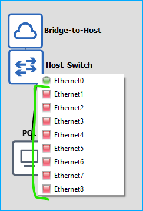

# Ubuntu GNS3 Container

This is a fork of [jsimonetti/gns3-server](https://github.com/jsimonetti/docker-gns3-server) to use Ubuntu instead of 
Alpine, primarilly to support Cisco IOS-On-Unix (IOU).

It has been optimized to work with [Devcontainers](https://containers.dev/) and has been tested to work in both Docker
and Podman

## Quick Start

```
docker run --sysctl net.ipv4.ip_forward=1 --cap-add NET_ADMIN -p 8080:8080 --rm ghcr.io/justingrote/gns3
```
If you have devcontainers or port forwarding enabled you can reach the GNS3 Web UI at
http://localhost:3080 (note NOT HTTPS by default)

## Bridge Interface
The container by default creates a bridge interface `gns3net0` which has DHCP. By creating a GNS3 cloud and linking it to this interface, the attached device gets a DHCP address, DNS server, and default gateway. 

IP Addresses start at 172.21.1.10 by default and increment sequentially, so the first device you attach will be 172.21.1.10, next will be 172.21.1.11, and so on.

I recommend using a GNS3 switch attached to the cloud so you can attach multiple separate devices on their "management" interfaces to this special interface. This repository contains a sample project to get you quickly started with this setup.



### Accessing Device Consoles
Serial Consoles are advertised from the container starting at port 2501 by default. VSCode will automatically detect these and auto-forward them for you. You can also use the GNS3 web interface.

For in-band access, attach the device to the bridge interface and note the IP it receives (by default 172.21.1.x), then configure your routing table to forward to the eth0 address of the container. For example, if your container is named `gns3`, do this in bash which will use the DNS name gns3 that docker should auto-advertise:

```shell
GNS3_NETWORK=172.21.1.0
ip route add $GNS3_NETWORK via $(getent hosts gns3 | awk '{ print $1 }')
```

You should now be able to directly ping/ssh/http/whatever to your attached devices at their attached IP addresses.

## Volumes
All data about the GNS3 is saved persistently to the /data path, which is established as a separate docker volume by default. You can mount your own volume here to persist images, projects, and configuration.

## Container Parameters

You can override these parameters by specifying them as [Docker environment variables](https://docs.docker.com/reference/cli/docker/container/run/#env).

| Variable            | Default Value           | Description                                 |
|---------------------|------------------------|---------------------------------------------|
| `BRIDGE_NAME`       | `gns3net0`             | Name of the bridge interface                |
| `BRIDGE_ADDRESS`    | `172.21.1.1/24`        | IP address and subnet for the bridge        |
| `BRIDGE_DHCP_START` | `172.21.1.10`          | Start of DHCP address range                 |
| `BRIDGE_DHCP_END`   | `172.21.1.250`         | End of DHCP address range                   |
| `DHCP_LEASE_AGE`    | `4h`                   | DHCP lease duration                         |
| `CONFIG`            | `/data/gns3_server.conf` | Path to the GNS3 server configuration file  |
